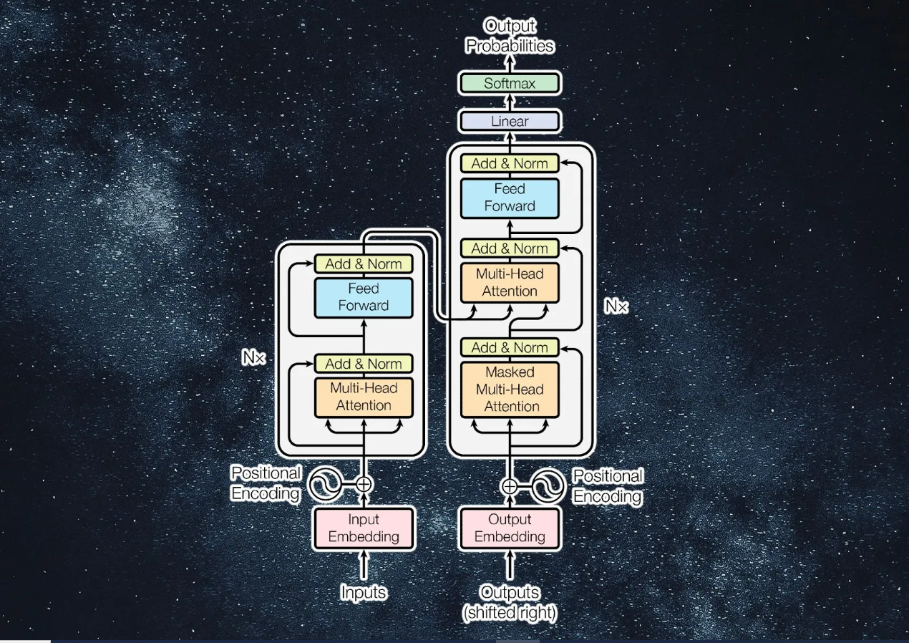

<h1 style="text-align:center;">Unleashing the Transformer: Let's Build a Chatty Bot!</h1>

<h3>Overview</h3>

In this <a href="https://nbviewer.org/github/GhaithMag/Transformers_Chatbot_Pytorch/blob/main/Tutorial_Transformers_chatbot.ipynb" target="_blank">notebook</a>, we will explore the architecture of Transformers by building a chatbot. We'll be using the <a href="http://www.cs.cornell.edu/~cristian/data/cornell_movie_dialogs_corpus.zip" target="_blank">Cornell Movie Dialog Corpus</a> as our dataset. Transformers have revolutionized the field of Natural Language Processing (NLP) with their parallel processing capabilities and attention mechanisms. By using this dataset, we'll get hands-on experience in understanding how Transformers can be applied to real-world language data. Let's delve into the architecture to understand how it works from the ground up.

<h3>What are Transformers?</h3>

Transformers are a type of machine learning model that have become the cornerstone of modern NLP applications. Introduced in the paper "Attention Is All You Need" by Vaswani et al. in 2017, they have set new benchmarks in tasks like machine translation, text summarization, and question-answering.

<h3>Detailed Architecture of Transformers</h3>

<h4>Encoder</h4>
<ol>
    <li>Input Representation: The first step in the encoder is to convert words into vectors using word embeddings.</li>
    <li>Positional Encoding: Transformers don't have a built-in sense of sequence, so positional encodings are added to the word embeddings to give the model information about the positions of the words.</li>
    <li>Multi-Head Attention: This is where the Attention Mechanism comes into play. It allows the model to focus on different parts of the input text when producing the output.</li>
    <li>Normalization and Feed-forward Neural Networks: The output from the attention layers goes through normalization and a series of feed-forward neural networks.</li>
    <li>Residual Connection: Helps in avoiding the vanishing gradient problem in deep networks.</li>
</ol>

<h4>Decoder</h4>
<ol>
    <li>Input Representation: Similar to the encoder, the decoder starts with word embeddings and positional encodings.</li>
    <li>Masked Multi-Head Attention: A slight variation of the attention mechanism that prevents the model from looking ahead into the future tokens in the sequence.</li>
    <li>Encoder-Decoder Attention Layer: This allows the decoder to consider the encoder's output while generating each token in the output sequence.</li>
    <li>Feed-forward Neural Networks: Similar to the encoder, the decoder also contains feed-forward neural networks and normalization layers.</li>
    <li>Output Sequence: The final layer of the decoder is a linear layer followed by a softmax to produce the output probabilities for each token in the vocabulary.</li>
</ol>

<h3>How to Use This Repository</h3>

This repository contains notebooks that guide you through the process of building a chatbot using Transformers. Please note that GitHub's preview may not display the entire content of the notebooks. To view the complete notebooks, you can follow the links below:

<ol>
    <li><a href="https://nbviewer.org/github/GhaithMag/Transformers_Chatbot_Pytorch/blob/main/Part%201%20Data%20Preprocessing%20.ipynb" target="_blank">Data Preprocessing Notebook</a>: This notebook covers the data preprocessing steps necessary for training the chatbot. Once you've cloned the repository, you can access this notebook locally.</li>
    <li><a href="https://nbviewer.org/github/GhaithMag/Transformers_Chatbot_Pytorch/blob/main/Part%202%20Model%20training.ipynb" target="_blank">Training Model Notebook</a>: Here, you'll find the details of the model training process. Once you've cloned the repository, you can access this notebook locally.</li>
    <li><a href="https://nbviewer.org/github/GhaithMag/Transformers_Chatbot_Pytorch/blob/main/Tutorial_Transformers_chatbot.ipynb" target="_blank">Tutorial Notebook</a>: This comprehensive notebook combines all the steps and explanations for building the chatbot. Once you've cloned the repository, you can access this notebook locally where everything is displayed correctly.</li>
</ol>

<h3>Objective</h3>

By the end of this tutorial, you will have a functional chatbot built on the Transformer architecture. You will gain a deep understanding of how each component contributes to the model's performance, from input representation to output generation.

<h4>Additional Resources:</h4>
<ul>
    <li>
        For a deep dive into the Attention mechanism, refer to the original paper: 
        <a href="https://arxiv.org/pdf/1706.03762.pdf" target="_blank">Attention Is All You Need</a>.
    </li>
    <li>
        For a clear explanation of the Transformer mechanism, check out this YouTube video by StatQuest: 
        <a href="https://www.youtube.com/watch?v=zxQyTK8quyY&list=PLblh5JKOoLUIxGDQs4LFFD--41Vzf-ME1&index=20" target="_blank">StatQuest: Transformers</a>.
    </li>
</ul>

</body>
</html>
